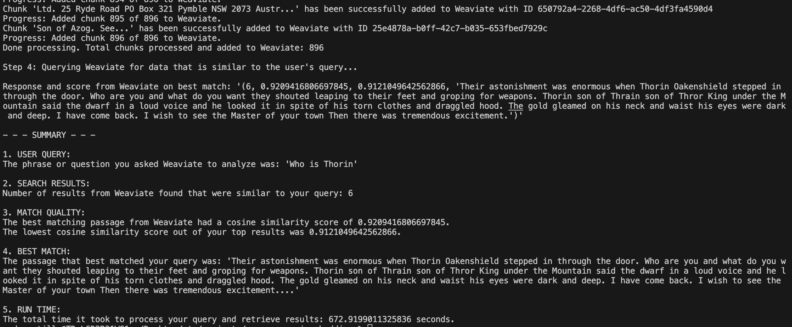

# Weaviate-Powered PDF Text Processing and Analysis

[Weaviate](https://www.semi.technology/developers/weaviate/current/) is an open-source, GraphQL and RESTful API-based, knowledge graph platform. The primary purpose of this script is to extract, process, and analyze text data from PDF documents using Weaviate and Python.

## Weaviate in the Context of PDF Processing

In this demo, Weaviate plays a critical role in processing and analysing the extracted content from PDF documents. Here's a detailed breakdown of how Weaviate is employed in the script:

### Data Storage

After the raw text is extracted and processed into chunks from the PDF document using Python, the script utilizes Weaviate's data storage capabilities to store these chunks. Each chunk of data is added as an individual object in a class within Weaviate. Weaviate's knowledge graph structure allows efficient storage of these chunks while maintaining their contextual relationships.

### Text Analysis

Weaviate is not simply used as a data storage solution in this script. It also plays a central role in the text analysis process. With its in-built 'text2vec' module, Weaviate transforms the stored data chunks into vectors. This vectorization process is fundamental for the subsequent querying and information retrieval stages, as it enables semantic search capabilities.

### Semantic Search  

After vectorizing the stored text data, Weaviate offers powerful semantic search features. The script includes an example of how to perform a query on the stored data with Weaviate. By sending a user-defined query to the Weaviate instance, the system returns the data chunks that bear the most similarity to the query text. This is made possible by Weaviate, comparing the vector of the query text with the vectors of the stored data chunks.

### Integration with OpenAI's Language Models

The script leverages Weaviate's integration with OpenAI's language models to enhance the results of the semantic search. When creating the data schema, the script assigns the 'generative-openai' and 'text2vec-openai' modules to the class that stores the data chunks. The 'generative-openai' module, which uses the GPT-3.5-turbo model, enhances the generation of text in the analysis phase. The 'text2vec-openai' module, employing the ada model, bolsters the process of converting the stored text to vectors.

In summary, Weaviate plays an indispensable role in the Python script, responsible for efficient data storage, facilitating semantic search and ensuring contextual relevance in returned results. Its integration with OpenAI's language models further enhances the understanding and treatment of the data, ensuring high quality and highly relevant search results.

This script is built on the premise that any information embedded in PDF documents can be processed and stored for further analysis. The flexibility of what to put into Weaviate is endless - spotting trends, finding insights, making predictions - and this script opens up a vast realm of possibilities.

The core of this script utilizes Python, a versatile and powerful programming language, to ingest contents of a PDF document, specifically a book in this case. After breaking down and normalising the text, the Python script stores discrete chunks of data into a Weaviate instance. But it doesn't stop at books! This Python script can efficiently process any PDF documentation - reports, articles, whitepapers, manuals, and more.

## How does it work?

The script preprocesses the data by extracting the text from the provided PDF document, normalizing it, and then splitting it into tokenised sentences or chunks of a defined length. It then adds these discrete chunks into Weaviate as individual objects. The chunks can then be queried leveraging vectorization and OpenAI's language models that can be performed on the stored data in Weaviate.

The powerful combination of Weaviate's ability to store, organise, and retrieve contextually relevant data, and Python's capability to efficiently parse PDFs, provides an excellent system for information retrieval, semantic search, and further text analytics.

The script also shows how to perform semantic searching within the stored data by passing a user-defined query, and leveraging Weaviate's capability to return contextually similar results.

## Benefits and Versatility

This system can be utilized for any kind of text-based analyses, applications, or even as the backbone of a large scale question-answering system. Since Python enables processing of multi-format data sources and Weaviate can store and query diverse and large-scale data, the opportunities are limitless.

## Specific Hobbit-related example of Semantic Search

After processing the data from the PDF document and adding the chunks to Weaviate as individual objects, the script performs a semantic search on the data. This is done by querying Weaviate with a user-specified query and displaying the top results that have the highest similarity to the query.

Below is an example of the output of such a query:

From the screenshot, we see that the user query was "Who is Thorin". The script then reached out to Weaviate, which returned the top six results that were most semantically similar to the query.

Weaviate assigns a cosine similarity score for each result, ranging from 0 (being the most dissimilar) to 1 (being identical). This score quantifies how closely each result matches the user query. The highest scoring passage had a cosine similarity score of approximately 0.921, indicating a high degree of semantic similarity with the query.

The passage that best matched the query was: 

>Their astonishment was enormous when Thorin Oakenshield stepped in through the door. Who are you and what do you want they shouted leaping to their feet and groping for weapons. Thorin son of Thrain son of Thror King under the Mountain said the dwarf in a loud voice and he looked it in spite of his torn clothes and draggled hood. The gold gleamed on his neck and waist his eyes were dark and deep. I have come back. I wish to see the Master of your town Then there was tremendous excitement....'

This output not only provides a brief introduction to the character "Thorin", but also gives some context about the situation. As such, this result is a meaningful response to the user query.

## Summary

In conclusion, this script seamlessly combines the power of Python for text processing from PDF documents and the strength of Weaviate for storing, retrieving, and querying contextual data. With this script, harness the ability to dig into any PDF document data, extract meaningful insights, and deliver superb analysis results. 